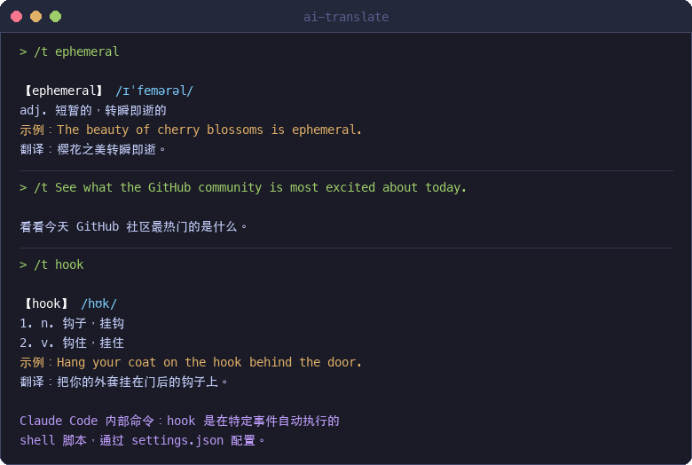

# ai-translate

[中文文档](README_CN.md)

AI translate tool for Claude Code, Codex, OpenCode, Cursor & Windsurf. One-line install, multi-language support with speech.

---



## Why ai-translate

1. **The only multi-tool translation plugin** — Works across Claude Code, Codex, Cursor, Windsurf & OpenCode
2. **Zero friction** — Never leave your coding tool, just `/t word`
3. **AI-native** — Powered by the built-in LLM, no extra API key needed
4. **Ultra-lightweight** — Just a prompt file, zero dependencies, minimal token usage
5. **TTS built-in** — `/ts` reads aloud after translating

## Features

- **Multi-language** — Auto-detect input language. Chinese to English, any other language to Chinese
- **Polysemy** — Up to 5 meanings for words with multiple definitions
- **Speech** — Text-to-speech pronunciation (macOS / Windows / Linux)
- **AI Tool Context** — Recognizes AI tool commands and explains their usage
- **Markdown Formatting** — Bold, italic, code style for better readability
- **Multi-tool Support** — Claude Code, Codex, OpenCode, Cursor, Windsurf

## Installation

### One-line install

```bash
curl -fsSL https://raw.githubusercontent.com/stormzhang/ai-translate/master/install.sh | bash
```

### Or clone and install

```bash
git clone https://github.com/stormzhang/ai-translate.git
cd ai-translate
./install.sh
```

The installer auto-detects which AI tools you have and installs accordingly:

```
[OK] Claude Code - installed
[OK] Codex - installed

Done! v1.0.0 installed

Usage:
  /t word          translate
  /ts word         translate + speech
  (Codex: $t word / $ts word)
```

## Usage

### `/t` — Translate

Translate only, no speech.

#### Translate a word

```
> /t ephemeral

【ephemeral】 /ɪˈfemərəl/
adj. 短暂的，转瞬即逝的
示例：The beauty of cherry blossoms is ephemeral.
翻译：樱花之美转瞬即逝。
```

#### Polysemy (multiple meanings)

```
> /t run

【run】 /rʌn/
1. v. 跑，奔跑
2. v. 运行，执行（程序、命令）
3. v. 经营，管理
4. v. 运转，运行（机器）
5. n. 奔跑；一段时间
示例：The program runs smoothly on my machine.
翻译：这个程序在我的机器上运行流畅。
```

#### Chinese to English

```
> /t 短暂的

【短暂的】 ephemeral /ɪˈfemərəl/
示例：Fame is ephemeral, but knowledge lasts forever.
翻译：名声转瞬即逝，但知识永存。
```

#### Translate a sentence

```
> /t See what the GitHub community is most excited about today.

看看今天 GitHub 社区最热门的是什么。
```

#### AI tool command recognition

```
> /t hook

【hook】 /hʊk/
1. n. 钩子，挂钩
2. v. 钩住，挂住
示例：Hang your coat on the hook behind the door.
翻译：把你的外套挂在门后的钩子上。

Claude Code 内部命令：hook 是在特定事件（如工具调用前后）自动执行的
shell 脚本，通过 settings.json 配置，用于自动化工作流。
```

### `/ts` — Translate + Speech

Same as `/t`, but also reads the text aloud after translating.

```
> /ts deprecated

【deprecated】 /ˈdeprəkeɪtɪd/
adj. 已弃用的，不推荐使用的
示例：This API method is deprecated and will be removed in v3.
翻译：这个 API 方法已弃用，将在 v3 中移除。

🔊 Playing audio...
```

Speech support by platform:

| Platform | Engine |
|----------|--------|
| macOS | `say -v Samantha` |
| Windows | PowerShell `SpeechSynthesizer` |
| Linux | `espeak` |

> Note: Speech on Windows and Linux is untested. Contributions welcome.

## Supported Tools

| Tool | Install Path | Invoke |
|------|-------------|--------|
| Claude Code (CLI / Desktop / Web) | `~/.claude/commands/` | `/t word` |
| Codex | `~/.codex/skills/` | `$t word` |
| OpenCode | `~/.config/opencode/commands/` | `Ctrl+K` → `user:t` |
| Cursor | `~/.cursor/commands/` | `/t word` |
| Windsurf | `~/.codeium/windsurf/global_workflows/` | `/t word` |

## Update

Run the same install command again. The installer will detect existing installation and ask before overwriting:

```
Claude Code 已安装翻译工具，是否覆盖更新？(y/N) y
[OK] Claude Code - updated
```

## License

[MIT](LICENSE)

## Author

**stormzhang** — [@stormzhang](https://github.com/stormzhang)
